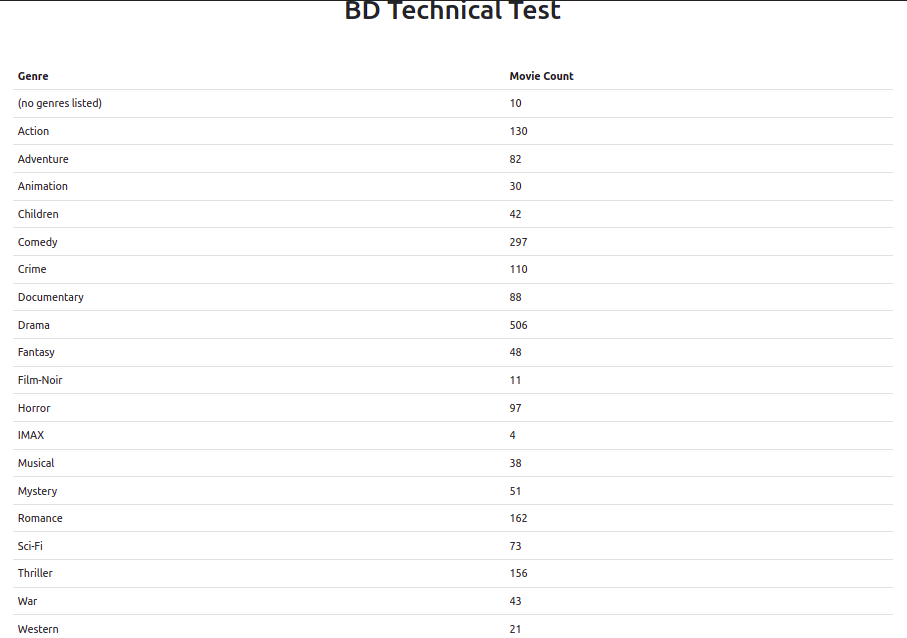
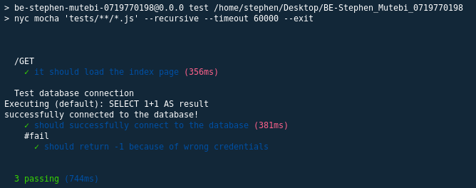
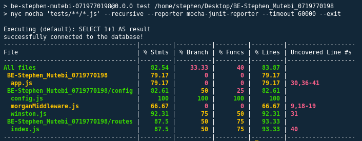

# **App Installation**
## **Getting Started**
- Clone the project and navigate into the project's root folder inside a terminal

    ```shell
    $ git clone https://github.com/StphnLwnga/BE-Stephen_Mutebi_0719770198.git
    ```
    ```shell
    $ cd BE-Stephen_Mutebi_0719770198
    ```

-  Install the necessary node modules

    ```shell
    $ npm install
    ```


## **Setting up**
- The data is stored in a mysql database.
- Import the database **`node_app.sql`** from the project root.

- Create a **`.env`** file in the project root and define the following variables

    ```s
    PORT=3000
    DB_HOST=
    DB_USER=
    DB_PASSWORD=
    DB_PORT=
    DB_DATABASE=
    ```

- Start the app with the following command

    ```shell
    $ npm start
    ```
- Open the app at **[localhost:3000](http://127.0.0.1:3000)**

## **Run tests**
- To run tests
    ```shell
    $ npm run test
    ```
- Test results are store in **`test-results.xml`**

## **Screenshots**

### **Application Output**



### **Test Results**


### **Test Coverage**


